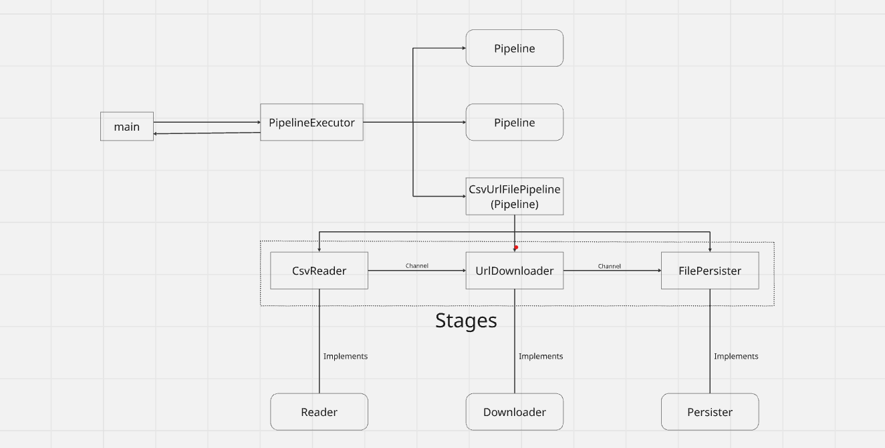

# Web Crawler

This is a simple web crawler implemented in GOLANG. It touches the URLs provided to it in the form of a csv file as an argument.

## Build and Run

### Prerequisites

- [Go](https://golang.org/doc/install) installed on your machine.

### Clone the Repository

```bash
git clone https://github.com/Sanjay1611/web_crawler.git
cd web_crawler
```

### Build and Run the Repository
```bash
go run cmd/main.go <path_to_csv_file_input>
```

## Testing
Run the unit tests using:

```bash
go test ./...
```

## Design
